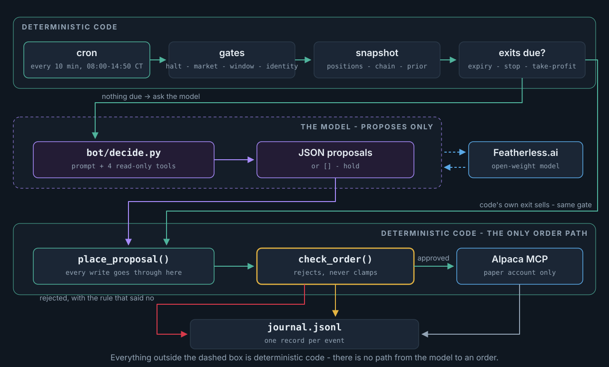

# Autobelay

**long premium, short leash** - an autonomous options agent on Alpaca's MCP server.
An auto belay is the device that catches a climber with nobody holding the other
end. Here the brake is deterministic code, and the model never touches an order.

*An autonomous options agent on Alpaca's MCP server. An open-source model
(Featherless) researches live bars, chains and news, then proposes
defined-risk premium trades; deterministic code sizes, stops, and closes every
one before expiry.* — Alpaca AI Trading Agents Hackathon, Aug 28–Sep 4, 2026.

> **Thesis:** Buy defined-risk, short-dated options premium on the five most
> liquid names when an open-source model sees a concrete reason; deterministic
> code sizes every trade, stops it, and closes it before expiry — the model
> never touches an order. Full statement: [docs/strategy.md](docs/strategy.md).

lablab.ai x Alpaca — Aug 28–Sep 4, 2026. Submission deadline Sep 4, 10:00 AM CDT.
See [docs/alpaca-official-guidelines.md](docs/alpaca-official-guidelines.md)
for Alpaca's full official rules/FAQ (copied verbatim) — this README
summarizes how our setup maps to them.

## Challenge: Options Alpha Agents

Build an autonomous AI trading agent that generates P&L using Alpaca's trading
platform, with a testable strategy.

**Core requirements**
- Autonomous agent using Alpaca's Trading API
- Must use Alpaca's MCP server or CLI
- Strategy must incorporate options trading
- Paper trading only, starting balance $100,000
- Judging on total account equity (not cash) plus workflow creativity/
  autonomy/robustness — P&L alone doesn't decide it

## Account

Two separate $100k Alpaca paper accounts, per Alpaca's rules (a testing
account can't be used for the official measurement):

- **`PA3VS39Y5LE2`** (created 2026-08-28) — the **official/judging**
  account. **No orders get placed on this account before Monday, Aug 31,
  9:30 AM ET.** Only equity from Mon 9:30 AM ET → Thu Sep 3 EOD counts
  toward scoring (snapshot Fri Sep 4, 9:30 AM ET). Read-only queries
  (account/positions/option chains) are fine any time.
- **`hackathon_test`** — safe to place real orders on for all development
  between now and Monday.

`bot/credentials.py:load_credentials()` defaults to `account="test"` for
exactly this reason — using the official account requires explicitly
passing `account="official"`, so an accidental order can't land on the
judging account. `scripts/verify_connection.py` mirrors this: defaults to
`--account test`, needs `--account official` to check the other one.

## Pre-event infrastructure (disclosure)

Per the official FAQ, infrastructure/boilerplate set up before kickoff is
allowed but must be disclosed: this repo's CT 108 hosting (Proxmox LXC),
Ansible deployment role, secrets pipeline (Alpaca + Featherless credentials),
and CI workflow were set up around/before the Aug 28 9:30 AM ET kickoff, in
the `homenetwork` infrastructure repo (private, separate from this
submission repo). No agent trading logic existed before kickoff.

## Architecture

Modeled on [`~/alpaca-trader`](https://github.com/bill-mccormick-dg/alpaca-trader)
(a working Claude-driven paper day-trading bot): deterministic snapshot → LLM
judgment → deterministic risk/execute, where risk checks never negotiate and
every order-placing path funnels through one guardrail function. Two things
differ here, both hackathon requirements:

- **[Alpaca's official MCP server](https://github.com/alpacahq/alpaca-mcp-server)**
  instead of raw SDK calls — the model gets broad *read* access (account,
  positions, option chains, bars) to research with, but never calls the
  order-placing tools directly; `bot/risk.py` validates every proposal
  before our own code submits anything. Alpaca's indicative options feed
  supplies IV and Greeks for most contracts; `bot/greeks.py` derives them via
  Black-Scholes only for the ones it does not price, and the prompt says which
  is which.
- **[Featherless.ai](https://featherless.ai)** (OpenAI-compatible) instead of
  the Claude CLI — an open-source model is a hackathon requirement. The judged
  account trades on `moonshotai/Kimi-K2.6`, the two challengers on
  `Qwen/Qwen3.8-Flash-Next` and `moonshotai/Kimi-K2-Instruct`, and the daily
  critique comes from whichever of those did *not* trade that account. The
  gates a model has to clear — tool calling, context, instruction adherence,
  a thinking-mode toggle, cost — and an honest account of how the incumbent
  actually got the seat are in
  [Why these models](docs/strategy.md#why-these-models);
  `python scripts/verify_models.py --all-configs --rejected` re-checks every
  mechanical claim against the live catalog.

Paper-only throughout — no live-trading code path exists.

<!-- diagram:runtime -->
<!-- generated by scripts/render_diagrams.py, source sha cd05f37917d5 - do not hand-edit -->
<p align="center">
  
</p>
<!-- /diagram:runtime -->

Everything outside the model's box is deterministic code. Full walk-through, plus
the infrastructure and CI/CD picture, in [docs/architecture.md](docs/architecture.md).

## Setup

1. ~~Create an Alpaca paper trading account, $100,000 balance~~ — done
   (`PA3VS39Y5LE2`, see [Account](#account) above)
2. Featherless AI credits ($25/participant) optionally available for open-source
   model inference — see event page for claiming instructions
3. `pip install -r requirements.txt`
4. `cp secrets.example.yaml secrets.yaml` and fill in `accounts.test.api_key` /
   `.secret_key` (from the **`hackathon_test`** account — never the official one
   locally) and the shared `featherless_api_key`. See
   [Where the keys come from](#where-the-keys-come-from) — the template names the
   exact vault variable behind each field.
5. Test: `python -m unittest discover -s tests` (credential-free unit tests),
   then `python scripts/verify_connection.py` (live check against the test
   account by default; `--account official` for the judging account, which
   should only ever get read-only calls before Monday — see [Account](#account))
6. Run a cycle: `python run_cycle.py --dry-run --force` (full snapshot →
   decide → risk-check on the test account, orders printed not sent, market
   gates skipped). Drop `--dry-run` to submit paper orders on the test account.
   `--account official` is refused outright before Mon Aug 31 9:30 AM ET
   unless `--dry-run` — hardcoded in `run_cycle.py`, not configurable.

### Where the keys come from

| You are | Where your keys come from |
|---|---|
| **Maintainer** | The private `homenetwork` repo's ansible vault. `cd ~/homenetwork/ansible && ansible-vault view vault.yml`, then copy by hand into `secrets.yaml`: `vault_alpaca_hackathon_test_api_key` → `accounts.test.api_key`, `vault_alpaca_hackathon_test_secret_key` → `accounts.test.secret_key`, `vault_alpaca_hackathon_featherless_api_key` → `featherless_api_key`. Deliberately copy-by-hand — no script here reads the vault. |
| **Teammate** | Your **own** Alpaca paper account (alpaca.markets → paper → generate keys), plus your own or the shared Featherless key. You never need the vault. |
| **The official account** | Nothing local, ever. Its keys exist only on CT 108 at `/root/.config/alpaca-hackathon/credentials.env`, deployed by homenetwork's `alpaca-hackathon` ansible role. |

> **Not these.** In that same vault, the bare `vault_alpaca_api_key` /
> `vault_alpaca_secret_key` (no `hackathon_`) — and the `pass alpaca/Key`
> password-store entry, verified to hold the identical value — belong to a
> **different project**, CT 107's `alpaca-trader`. They authenticate perfectly
> well and quietly trade the wrong account.

## Documentation

The onboarding and reference docs live in [`docs/`](docs/) (start at
[docs/index.md](docs/index.md)) and render as a Docusaurus site:
`docker compose up docs` → http://localhost:3000. Reading order: Onboarding →
Architecture → Strategy → Operations → The daily loop.

## Docker quickstart (local dev, any machine)

The production path is CT 108 + cron (below); this is for working on the bot
locally with nothing installed but Docker. Everything here uses a **test**
paper account — `run_cycle.py` refuses `--account official` before the
competition window regardless, and the official keys never leave CT 108.

```
cp secrets.example.yaml secrets.yaml   # your TEST paper keys + Featherless key
docker compose build
docker compose run --rm bot -m unittest discover -s tests   # 384 credential-free tests
docker compose run --rm bot                                 # = run_cycle.py --dry-run --force
docker compose run --rm bot run_cycle.py --dry-run --force --verbose
docker compose run --rm bot status.py
docker compose run --rm bot override.py show
```

`./logs` (journal, halt files, overrides) and `config.yaml` are bind-mounted,
so state persists across runs and config edits need no rebuild. Drop
`--dry-run` to place real paper orders **on the test account in `secrets.yaml`**.

## Team onboarding

1. Get added as a collaborator (repo is private until submission) and create
   your own Alpaca paper account for development — never share or use the
   official one (`PA3VS39Y5LE2`).
2. Follow the Docker quickstart above; confirm the tests and a dry-run cycle
   work before changing anything.
3. Workflow: small feature branch off `main` → push → PR → CI must be green →
   squash-merge → the self-hosted runner deploys `main` to CT 108 within a
   minute or two. Never commit to `main` directly; never commit `secrets.yaml`,
   `.env`, `logs/`, or credentials.
4. Read [docs/strategy.md](docs/strategy.md) (what the bot is trying to do and
   which decisions belong to code vs the model) and the **Operations** section
   below (how to run, stop, and read it). Open work is on the issue tracker,
   labelled `P1-monday` → `P4-later`.

## Operations

Everything runs from the repo root with the venv's Python
(`./.venv/bin/python` locally; `/opt/alpaca-hackathon/.venv/bin/python` on CT 108).
Every entrypoint takes `--account <name>` (default **test**) and `--config <file>`
(default `config.yaml`).

**Named accounts** (the two-account A/B): `official` reads `credentials.env` on CT 108
and *only* there; any other name reads `credentials-<name>.env` on CT 108, else its
`accounts.<name>` block in a local `secrets.yaml`, else the legacy `.env.<name>` /
`.env`. `secrets.yaml` must not contain an `official` entry — the loader rejects the
whole file if it does, for every account. Each account gets its own journal
(`logs/journal-<name>.jsonl`; the official account keeps `logs/journal.jsonl`),
its own overrides file, and its own halt files — a challenger can never stop
the official account, whether by breaching its daily-loss cutoff or by having
its kill switch pressed. Only the CLI-only break-glass `flatten.py --halt
--all-accounts` halts everything. `config-test.yaml` is the current challenger
config (Qwen3.8-Flash-Next); run it with
`run_cycle.py --account test --config config-test.yaml`.

| Command | What it does |
|---|---|
| `run_cycle.py [--dry-run] [--force] [--verbose]` | One cycle: gates → snapshot → decide → risk-check → execute. `--dry-run` prints orders instead of sending; `--force` skips the market-open / trading-window / entry-cutoff gates (rehearsal); `--verbose` prints the raw model output |
| `flatten.py [--halt] [--all-accounts]` | Cancel all orders, wait for the cancels to settle, close all positions, then poll until actually flat and report what is *really* still held. `--halt` also trips this account's kill switch; add `--all-accounts` for the break-glass halt that stops every account |
| `status.py [--json]` | Halt state, runtime overrides, account, positions, today's journal summary. Read-only — safe on the official account any time |
| `override.py show \| set <key> <value> [--until] \| clear <key>\|--all` | Intraday config tweaks without a deploy — see **Runtime overrides** below |
| `mail_report.py [--dry-run] [--force]` | Hourly team email: summary plus trades / cycles / equity as CSV attachments. A quiet hour (no orders, no flatten closes) sends nothing - so a missing hourly email means an idle hour, not a broken report; a halt or `--force` always sends, and the cron's 15:00 wrap-up entry passes `--force` so the end-of-day report survives quiet afternoons. Read-only, its own cron entry, sends nothing when no recipients are configured |
| `journal_viewer.py [--port 8300]` | The journal streamed to a browser over server-sent events — live follow, per-account filters, replay by date. LAN-bound and read-only; published at **[bot.wpmccormick.pw](https://bot.wpmccormick.pw)** through a Cloudflare tunnel with an email one-time PIN |
| `scripts/last_cycle.py [--account] [--day]` | One screen: the option chain and the prediction-market prior the model was given last cycle, what it decided, and what the funnel did with it. Journal-only, no credentials |
| `python -m unittest discover -s tests` | Credential-free guardrail tests |
| `scripts/verify_*.py` | Manual live checks (Alpaca connectivity, Featherless, snapshot, option-chain coverage) |
| `scripts/audit_citations.py --day <date>` | Which prior figures the model quoted that day that its prompt never contained |

**Halt files** (under `logs/`, checked at the top of every cycle):

- `logs/HALT` — **global** break-glass halt: stops *every* account. Written only by
  `flatten.py --halt --all-accounts`; deliberately unreachable from MQTT/Home
  Assistant, so no dashboard tap can stop the judging account. Nothing trades
  until you **delete the file**.
- `logs/HALT_manual` (official) / `logs/HALT_manual_<name>` (others) — that one
  account's kill switch, created by `flatten.py --halt` or the Home Assistant
  button. Only that account stops; the others keep trading.
- `logs/HALT_<YYYY-MM-DD>` — daily-loss halt, written by `run_cycle.py` after it
  breaches `daily_loss_cutoff_pct` and flattens. Expires on its own at the next
  trading day; delete it to resume early.

**Runtime overrides** (`override.py`, `bot/overrides.py`): two config layers with
explicit precedence — `config.yaml` (git) is the base; `logs/overrides.yaml`
(runtime, on the CT, never committed) wins for an allowlisted set of
strategy/model/exit knobs: `model`, `temperature`, `max_tokens`, `strategy_notes`,
`research_contracts_per_underlying`, `option_strike_band_pct`, `stop_loss_pct`,
`take_profit_pct`, `eod_close_dte`. Hard risk caps are git-only on purpose.
Overrides **expire at 16:00 ET the same day** unless `--until` is given, so
intraday tweaks come from here and durable changes come from a PR — tomorrow
always starts from git. Every cycle journals a `config` event with the
effective values, a config hash, and the active overrides, so nothing changes
silently. The MQTT/Home Assistant bridge calls the same functions.

**Journal**: `logs/journal.jsonl`, one JSON record per event with an Eastern-time
`ts` — `cycle_start`, `decision` (raw model output), `order_submitted` /
`order_rejected` / `order_error` / `dry_run` (with the reason), `daily_loss_halt`,
`daily_loss_flatten`, `flatten`, `manual_halt`, `error`, `cycle_end`.
`status.py` summarizes today's; `bot/journal.py::read_events()` for anything else.
`logs/` is git-ignored and excluded from the CI deploy rsync, so state on CT 108
survives redeploys.

**Official-account safety** (`PA3VS39Y5LE2`, see [Account](#account)): `run_cycle.py`
and `flatten.py` refuse `--account official` before Mon Aug 31 9:30 AM ET unless
`--dry-run` — hardcoded in `run_cycle.py`, not configurable. Paper-only throughout:
`ALPACA_PAPER_TRADE=true` is hardcoded in `bot/alpaca_mcp.py` and no live-trading
code path exists. The model never gets an order-placing tool; every order funnels
through `bot/execute.py::place_proposal()` → `bot/risk.py::check_order()`.

**Account-identity guard** (`bot/identity.py`): every gate above keys on the
`--account` *string*. This one keys on the account number the broker reports, so
the judging account's keys reaching a non-official name — a mis-copied
`secrets.yaml` block, a stray `ALPACA_API_KEY`, the wrong vault variable — is
caught rather than quietly traded while every log line says "test". Checked at
cycle start in `run_cycle.py`, before flattening in `flatten.py`, and again inside
`check_order()` so no order path can miss it. The policy is asymmetric on purpose:

- A **non-official** run is fail-closed. If the number is the judging account, or
  can't be read at all, it refuses — a skipped challenger cycle costs nothing.
- The **official** run refuses a confirmed mismatch, but if the number simply
  can't be read it warns and proceeds: a parsing regression must not take the
  judged account out of the market. The warning is printed and journalled
  (`identity_unverified`); refusals journal `identity_refused`.

`flatten.py --halt` still writes its halt file even when identity is refused —
the break-glass kill switch must work regardless of what the credentials point at.

## License

MIT — see [LICENSE](LICENSE). The hackathon's prize terms require submissions
to be original and MIT-compliant; everything in this repository is original
work for the event (the pre-event infrastructure is disclosed above) and
depends only on permissively licensed packages (`alpaca-mcp-server`, `mcp`,
`httpx`, `PyYAML`, `python-dotenv`). Market data is Alpaca's and subject to
Alpaca's terms; model inference is Featherless.ai's.

## Submission checklist

- [ ] Project title + short/long description
- [ ] Technology & category tags
- [ ] Cover image
- [ ] Video presentation
- [ ] Slide presentation
- [ ] Public GitHub repository — currently **private** (fine during the
      build phase per Alpaca's own FAQ), but lablab.ai's submission
      checklist separately requires "Public GitHub repository" as a
      submission item. **Flip back to public before the Sep 4, 10:00 AM
      CDT deadline.**
- [x] MIT license in the repo (`LICENSE`) — prize terms require submissions to
      be "original and MIT-compliant"
- [ ] Demo application URL — likely N/A, UI not required (FAQ); only needed
      if we ship a demo app judges must open
- [ ] Alpaca paper trading account ID (required for judging) — `PA3VS39Y5LE2`
- [ ] One-page write-up: AI logic, risk gates, Alpaca infra
- [ ] Up to 5 social posts (X/LinkedIn, tag @lablabai and @AlpacaHQ)
- [ ] **No orders placed on the account before Mon Aug 31, 9:30 AM ET**
- [ ] Agent trading live by Mon Aug 31, 9:30 AM ET
- [ ] **Submit the lablab.ai form — a filled draft is not a submission.** It
      is a 3-step wizard; as of 2026-08-30 it sits at step 1 of 3 (36%), so
      the team shows under "drafts in progress", not "submissions". See
      [submission/METADATA.md](submission/METADATA.md) for exactly what is
      left. There is no P&L leaderboard for this event, so nothing surfaces
      the project except the submission itself.
