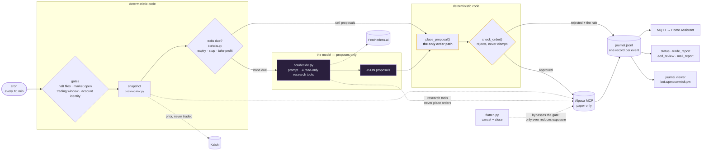
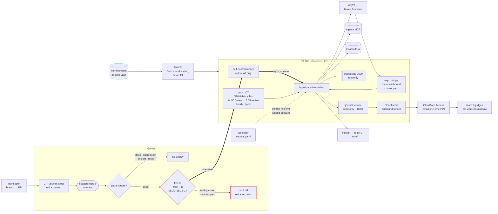

# Architecture

Modelled on a working Claude-driven paper day-trading bot (`alpaca-trader`):
**deterministic snapshot -> LLM judgment -> deterministic risk/execute**, where
risk checks never negotiate and every order-placing path funnels through one
guardrail function. Two things differ, both hackathon requirements: all market
data and orders go through **Alpaca's official MCP server**, and the model is
an open-source one on **Featherless.ai** instead of the Claude CLI.

## One cycle

`run_cycle.py`, from cron every 10 minutes in market hours. The model occupies
exactly one box, and it emits proposals - never orders.

<!-- diagram:runtime -->

Reading it: everything outside the purple box is deterministic code. The model
receives the snapshot and may call four read-only research tools; it returns a
JSON array of proposals. Both the model's proposals *and* the code's own exit
sells go through the same `place_proposal()` → `check_order()` funnel.

The one exception is drawn deliberately: `flatten.py` cancels orders and closes
positions without passing `check_order()`, because it only ever *reduces*
exposure ([`bot/flatten.py`](https://github.com/bill-mccormick-dg/alpaca-hackathon/blob/main/bot/flatten.py)).
A diagram claiming every write goes through the gate would be wrong.

## Modules

| Module | Role | Notes |
|---|---|---|
| `bot/alpaca_mcp.py` | Thin async client around `alpaca-mcp-server` (stdio) | `ALPACA_PAPER_TRADE=true` hardcoded; retries transient connect errors only |
| `bot/credentials.py` | Named accounts -> credential files | `official` never reads `secrets.yaml` or `.env` |
| `bot/identity.py` | Broker account number vs the `--account` name | The only guard keyed on the credentials, not the CLI string; fail-closed for challengers, warn-and-proceed for `official` |
| `bot/config.py` + `bot/overrides.py` | `config.yaml` + runtime overrides (allowlisted, expire 16:00 ET) | `config_provenance()` is what the journal records each cycle; `resolve_review_model()` picks a reviewer that did not trade the day, recomputed each call so a dashboard model swap cannot make an account its own reviewer |
| `bot/snapshot.py` | Account/positions, option chains in a strike band around spot, clock | `feed=indicative` always (no OPRA) |
| `bot/greeks.py` | Black-Scholes IV solve (bisection) + delta/gamma/theta/vega | Alpaca's free feed has none |
| `bot/predictions.py` | Kalshi daily index-close markets -> implied median, P(above prior close), P(\|move\|>1%) | prior only, never traded |
| `bot/learning.py` | Facts-only block: recent round trips, open positions vs entry, today's rejections by rule | windowed, capped |
| `bot/research.py` | Four read-only tools the model may call (bars, stock snapshot, option contracts, news) | maps to MCP with fixed safe args; nothing that orders |
| `bot/decide.py` | Prompt assembly, bounded tool loop, lenient proposal parsing, `Decision` (usage, latency, reasoning, tool calls) | thinking models need `model_params` |
| `bot/exits.py` | expiry / stop_loss / take_profit rules, checked before the model | code decides when a trade is done |
| `bot/risk.py` | `RiskManager.check_order()` - the one gate; halt files; trading window | never clamps, only rejects with a reason |
| `bot/execute.py` | `place_proposal()` - the one order path | numeric fields stringified for MCP |
| `bot/flatten.py` + `bot/orders.py` | Flatten all / expiring-only, verified against the broker | cancel -> wait -> close -> poll until flat |
| `bot/journal.py` | JSONL journal per account; `daily_summary()` | the single "something happened" chokepoint |
| `bot/trades.py` | FIFO round-trip pairing from fills, x100 multiplier, exit classification, cuts | pure |
| `bot/review.py` | End-of-day digest facts + markdown | pure; the advisory read is asked of a model that did *not* trade the day |

Entrypoints: `run_cycle.py`, `flatten.py`, `status.py`, `override.py`,
`trade_report.py`, `eod_review.py` - all take `--account <name>` and
`--config <file>`.

## Who decides what

| Decision | Who |
|---|---|
| Which underlyings, all caps and windows | humans, in `config.yaml` (git) |
| Whether there is a reason to trade, direction, which contract | the model |
| Whether a proposal is allowed at all; sizing caps; DTE; entry cutoff | code (`risk.py`) |
| When a position is done (stop / take-profit / expiry) | code (`exits.py`) |
| Daily-loss halt, kill switch, end-of-day, final day | code |
| The only order path | code (`execute.py`) |
| Which model critiques the day afterwards | code (`config.py::resolve_review_model`), from a preference list, excluding the model that traded |

## Infrastructure

The bot runs on our own hardware - a Proxmox LXC ("CT 108"), not a laptop -
and deploys itself from a runner living on that same container.

<!-- diagram:infra -->

- **CT 108** (Proxmox LXC, Debian 12): venv + cron, credentials only readable
  by root, `logs/` owned by the runner user. Provisioned by Terraform +
  Ansible in a separate private repo (`homenetwork`), disclosed in the README.
- **CI/CD**: GitHub Actions lint+test on every PR; a **self-hosted runner on
  CT 108** rsyncs `main` into `/opt/alpaca-hackathon` on every merge (a
  sanity check refuses to sync an incomplete checkout). The freeze is a hard
  failure rather than a skip: a red X on `main` is the signal that `main` and
  the trading host have diverged.
- **Journal viewer**: [`journal_viewer.py`](https://github.com/bill-mccormick-dg/alpaca-hackathon/blob/main/journal_viewer.py)
  is the journal's third consumer (after MQTT and the report scripts) - a
  stdlib-only page streaming all three accounts' journals live, read-only by
  construction: it opens the journal files and nothing else, loads no
  credentials, and has no POST route. It binds a LAN port (`:8300`) on CT 108
  and is published at **<https://bot.wpmccormick.pw>** through a Cloudflare
  Tunnel with Access (email one-time PIN) in front. Same trust shape as the CI
  runner: `cloudflared` connects *outbound*, so nothing inbound reaches the CT.
  The systemd unit and tunnel live in the private `homenetwork` repo's
  `alpaca-hackathon` / `cloudflared` roles; who may log in is Cloudflare
  dashboard state, deliberately not IaC. Day-to-day usage is in
  [Operations](operations.md#the-journal-in-a-browser).
- **Local**: `docker compose` - the bot image (tests, dry runs, your own paper
  account) and this docs site.
